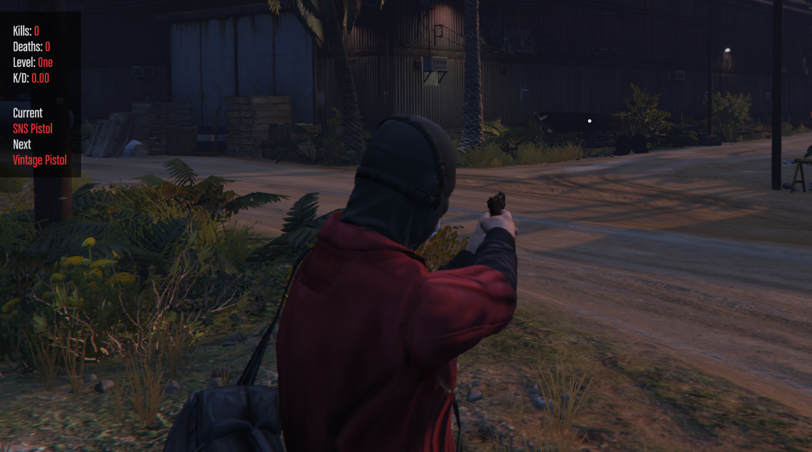

# RxGunGame

A gungame with lobby, maps, scoreboard, leaderboard & levels. Your players will never be bored again.
(code is from 2 years ago, dont come @ me :D)


## [Download](https://github.com/rxscripts/RxGunGame/releases/latest/download/RxGunGame.zip)

## ⚠️ Dependencies
- [fmLib](https://github.com/meesvrh/fmLib)
- [ox_lib](https://github.com/overextended/ox_lib)
- [oxmysql](https://github.com/overextended/oxmysql)

## 🖥️ Installation
* 1. Install (*or ensure you have the latest of*) each dependency listed above
* 2. Download the latest release of ```RxGunGame```
* 3. Extract the zipped folder into your servers main ```resources``` directory
* 4. Add ```ensure RxGunGame``` in your ```server.cfg``` file *after* all dependencies
* 5. Executee ```GunGame.sql``` in your ```database```
* 6. Restart your server & enjoy!

### Ace Permissions
- `gungame.admin` - Allows access to all GunGame Admin commands

### Server Exports
- `StartGame(random, map)`: Starts a Game with specified Map, if random is true then it uses a random map.
- `IsGameFinishing()`: Returns whether the game is finishing or not.

### Client Exports
- `IsInGame()`: Returns whether the player is in game.

### States
***Note:*** *These states are all configurable.*

#### Server States
- `RX:GunGame:ActiveGame`
- `RX:GunGame:CurrentMap`
- `RX:GunGame:PlayersInGame`
- `RX:GunGame:RoundTimeLeft`

#### Client States
- `RX:GunGame:InGame`
- `RX:GunGame:CurrentLevel`
- `RX:GunGame:OutsideZone`
- `RX:GunGame:Kills`
- `RX:GunGame:Deaths`

## ℹ️ Support
If you have any suggestions for new features, discovered a bug or having a problem with the script, feel free to contact us at anytime via:
* [Discord](https://discord.gg/DHnjcW96an)

## ⭐ Take a look at our other products!
### Activities
* [Advanced Mining](https://store.rxscripts.xyz/scripts/advanced-mining?utm_source=github&utm_medium=free-script)
* [Advanced Hunting](https://store.rxscripts.xyz/scripts/advanced-hunting?utm_source=github&utm_medium=free-script)
* [Advanced Fishing](https://store.rxscripts.xyz/scripts/advanced-fishing?utm_source=github&utm_medium=free-script)
* [Advanced Drug Labs](https://store.rxscripts.xyz/scripts/advanced-drug-labs?utm_source=github&utm_medium=free-script)
* [Advanced Plantation](https://store.rxscripts.xyz/scripts/advanced-plantation?utm_source=github&utm_medium=free-script)
* [Advanced Player Stores](https://store.rxscripts.xyz/scripts/advanced-player-stores?utm_source=github&utm_medium=free-script)
### General
* [Reports PRO](https://store.rxscripts.xyz/scripts/reports-pro?utm_source=github&utm_medium=free-script)
* [Housing Perfect](https://store.rxscripts.xyz/scripts/housing-perfect?utm_source=github&utm_medium=free-script)
* [Black Markets](https://store.rxscripts.xyz/scripts/black-markets?utm_source=github&utm_medium=free-script)
* [Gang Wars](https://store.rxscripts.xyz/scripts/gang-wars?utm_source=github&utm_medium=free-script)
### Survival
* [Recyclers](https://store.rxscripts.xyz/scripts/recyclers?utm_source=github&utm_medium=free-script)
* [Smelters](https://store.rxscripts.xyz/scripts/smelters?utm_source=github&utm_medium=free-script)
* [Crates & Storages](https://store.rxscripts.xyz/scripts/crates-storages?utm_source=github&utm_medium=free-script)
* [Death System](https://store.rxscripts.xyz/scripts/death-system?utm_source=github&utm_medium=free-script)
* [Hazard Zones](https://store.rxscripts.xyz/scripts/hazard-zones?utm_source=github&utm_medium=free-script)
* [Chopshop](https://store.rxscripts.xyz/scripts/chopshop?utm_source=github&utm_medium=free-script)

## Previews




